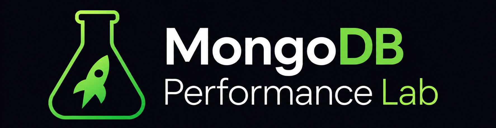
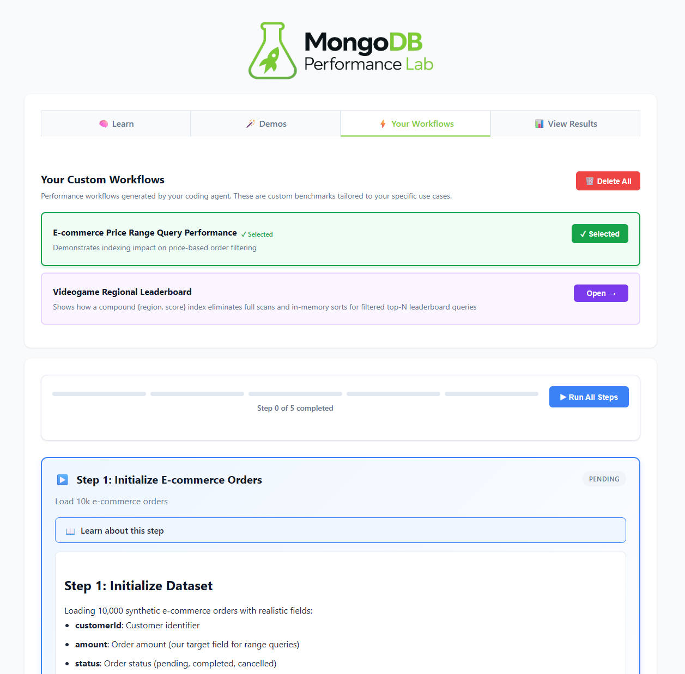

# MongoDB Performance Lab

[](https://unlicense.org)
[](https://www.docker.com/)
[](https://modelcontextprotocol.io)



MongoDB queries get slow. The fix is usually an index, but knowing *which* one, and proving the improvement before you ship, is where teams get stuck.

This is a local lab for that problem. Load realistic data, run controlled benchmarks, measure precisely what changed. Connect it to your coding agent via MCP and it becomes a diagnostic tool: explain your real queries, benchmark a fix against your actual schema, get a verified `createIndex` call with proof attached. Not a managed service. A lab you control. 🧪

---

## Quick Start

```bash
git clone https://github.com/spencershepard/mongodb-performance-lab.git
cd mongodb-performance-lab
docker compose up -d
docker compose exec perflab mdbpl test
open http://localhost:8888     # UI — use 'start' on Windows
```

---

## Connect Your Agent

Any MCP-compatible agent can connect to the running lab and work against your actual data.

Add to your MCP config (`~/.claude/settings.json` for Claude Code, `.cursor/mcp.json` for Cursor):

```json
{
  "mcpServers": {
    "mongodb-perflab": {
      "command": "docker",
      "args": [
        "compose", "-f", "/path/to/mongodb-performance-lab/docker-compose.yml",
        "exec", "-i", "perflab",
        "python", "mcp/server.py"
      ]
    }
  }
}
```

**Two ways to work with your data:**

- **Point at a real database** — set `MONGODB_URI` to a local dev instance and the agent works against your actual data and indexes.
- **No database needed** — the agent reads your queries, generates a schema from the fields they use, and loads realistic test data. The queries you're optimizing are all the context it needs.

---

## From Slow Query to Verified Fix

You ask: *"Why is my orders API slow?"*

The agent finds the query and explains it:

```
scan_type:           COLLSCAN
index_used:          none
total_docs_examined: 84,312
docs_returned:       47
verdict:             No index on 'customerId'. Add {customerId: 1} to orders.
```

Generates a benchmark for your schema, runs it:

```
Throughput:       12.4 → 1,847 ops/sec  (+14,800%)
Latency p95:      412ms → 2.8ms
$lookup strategy: NestedLoopJoin → IndexedLoopJoin
```

Hands you the `createIndex` call and explains why it works.

**Tools available to the agent:**

| Tool | What it does |
|------|-------------|
| `get_analysis_guide` | Find MongoDB queries in Node.js, Python, PHP, Java, Go |
| `get_best_practices` | Indexing and query optimization reference |
| `get_schema` | Introspect a live collection: indexes, doc count, field types, sample doc |
| `explain_query` | Run `explain()` on any query; returns scan type, index used, docs examined, verdict |
| `get_demo_examples` | Demo source the agent uses to adapt benchmarks to your schema |
| `execute_demo` | Execute a built-in or agent-generated demo, step by step |

---

## The UI

Open `http://localhost:8888` after `docker compose up -d`.

Every workflow — built-in or agent-generated — appears as an interactive sequence of steps. Before each step runs you can see exactly what will execute: the shell command, the mongosh script, or the pipeline. Step through manually to inspect each result, or run the whole sequence automatically. Benchmark results are browsable and selectable for side-by-side comparison.



**Demos are reusable artifacts.** Each is a plain Python class you can copy into a script or CI pipeline to make the benchmark repeatable on every deploy:

```bash
docker compose exec perflab python /workloads/my_demo.py
docker compose exec perflab mdbpl compare --tags before,after
```

---

## Six Demos, Six Pitfalls

Each demo loads data, measures a baseline, applies an optimization, measures again, and produces a side-by-side comparison. The numbers aren't estimates — they're what each demo produces every time it runs.

**Missing index** (`index-performance`)  
A range query with no index scans every document, every time. Add a single-field index: COLLSCAN becomes IXSCAN. Improvement: **50–100x**.

**Overindexing** (`overindexing`)  
Every index is maintained on every write. This demo adds indexes one at a time and measures the cost of each one. By the fourth index, writes are **30–70% slower**.

**Compound index design** (`compound-index`)  
Two single-field indexes can't both be used on a query that filters on both fields. A single compound index in ESR order can. Improvement: **5–15x**.

**Aggregation pipeline** (`aggregation-pipeline`)  
A `$match → $sort → $group` pipeline without the right index blocks on an in-memory sort every execution. The right compound index eliminates it. Improvement: **10–30x**.

**`$lookup` join strategy** (`lookup`)  
Without an index on the foreign field, `$lookup` does a full collection scan per input document — NestedLoopJoin. With one, it switches to IndexedLoopJoin. Improvement: **100–1000x**.

**Covering index** (`covering-index`)  
When the index contains every field the query needs, MongoDB never reads the document — `totalDocsExamined` drops to zero. Improvement: **25–30% in-memory**; **2–10x** with large documents or a cold cache.

```bash
docker compose exec perflab mdbpl demo run lookup
```

---

## Data That Looks Like Your Data

The generator is Python-native — no Java, no YCSB. It produces documents with domain-specific field names so `explain()` output and benchmark results use terminology that matches your application.

| Schema | Fields |
|--------|--------|
| `ecommerce` | `customerId`, `amount`, `status`, `region`, `createdAt`, `score` |
| `iot` | `deviceId`, `sensorType`, `value`, `unit`, `timestamp`, `score` |
| `events` | `userId`, `eventType`, `sessionId`, `page`, `timestamp`, `score` |
| `videogame` | `playerId`, `rank`, `region`, `wins`, `kills`, `kdr`, `score` |
| `customers` | `customerId` (sequential), `name`, `email`, `region`, `tier` |
| `orders` | `customerId` (ref → customers), `amount`, `status`, `productId`, `createdAt` |

The `customers` and `orders` presets are linked: orders sample real `customerId` values from the customers collection at load time, so every `$lookup` join matches a real document.

Custom schemas load from JSON:

```json
{
  "name": "products",
  "fields": [
    {"name": "sku", "type": "formatted_sequential", "format_string": "SKU-{:06d}"},
    {"name": "category", "type": "choice", "choices": ["electronics", "books", "clothing"]},
    {"name": "price", "type": "float", "min_val": 1.0, "max_val": 999.0},
    {"name": "inStock", "type": "bool"}
  ]
}
```

```bash
mdbpl init --scale 100k --schema path/to/products.json --collection products
```

---

## CLI Reference

All commands run inside the container via `docker compose exec perflab mdbpl <command>`.

```
Commands:
  init     Load test data into MongoDB
  run      Run a benchmark workload
  compare  Compare two tagged runs side-by-side
  report   View stored benchmark results
  demo     List and run guided demos
  test     Verify MongoDB connection
```

```
mdbpl init
  --scale TEXT        Record count: 10k, 50k, 100k, 1m  [default: 10k]
  --schema TEXT       Preset name or path to schema JSON  [default: default]
  --collection TEXT   Target collection  [default: usertable]
  --database TEXT     Target database  [default: perflab]
  --no-drop           Append to existing collection instead of replacing it
```

```
mdbpl run
  --workload TEXT     Built-in name or path to a .py Benchmark file  [required]
  --tag TEXT          Label for this run — used in mdbpl compare  [required]
  --duration TEXT     How long to run  [default: 30s]
  --threads INTEGER   Parallel workers  [default: 1]
  --collection TEXT   Target collection  [default: usertable]
  --pipeline TEXT     Aggregation pipeline JSON (raw workload only)

  Workloads: point-read  range-scan  update  insert  mixed  top-n  group-by  raw
```

```
mdbpl compare
  --tags TEXT         Two comma-separated tags: before,after  [required]
  Prints: throughput, latency p50/p95/p99, docs examined/returned, scan counts, % change
```

```
mdbpl report
  --last              Most recent run
  --tag TEXT          Run by tag
  --list              All stored runs
```

The `raw` workload accepts any aggregation pipeline with `{{field:distribution}}` substitution:

```bash
mdbpl run --workload raw \
  --pipeline '[{"$match": {"status": "{{status:uniform}}"}}, {"$limit": 100}]' \
  --tag baseline
# Distributions: uniform  zipfian  sequential  literal
```

---

## Custom Workloads

Drop a `.py` file in `./workloads/` to benchmark your own query patterns:

```python
# workloads/my_workload.py
from mdbpl import Benchmark

benchmark = Benchmark(name="my-workload", database="perflab", collection="usertable")

@benchmark.operation(weight=80, name="read")
def read(collection):
    return collection.find_one({"status": "active"})

@benchmark.operation(weight=20, name="write")
def write(collection):
    return collection.update_one({"status": "active"}, {"$inc": {"score": 1}})
```

```bash
mdbpl run --workload /workloads/my_workload.py --tag custom
```

---

## License

Released into the public domain under the [Unlicense](https://unlicense.org). See [LICENSE](LICENSE).

**Created by:** [Spencer Shepard](https://github.com/spencershepard)
